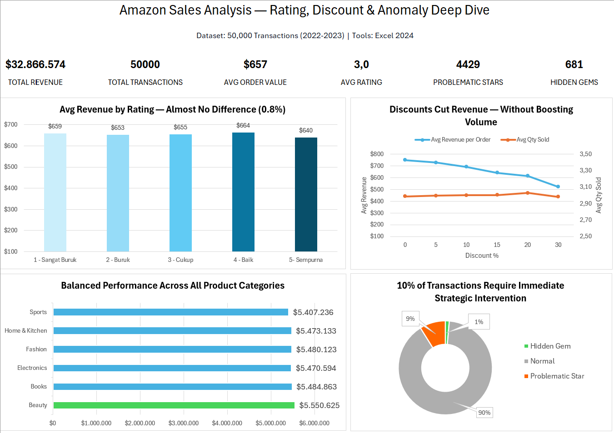

# 📊 Amazon Sales Analysis — Does Rating Drive Revenue?

Analisis data terhadap **50.000 transaksi e-commerce Amazon (2022–2023)** untuk mengevaluasi apakah **rating produk dan strategi diskon memengaruhi revenue penjualan**, serta mengidentifikasi peluang optimasi strategi pemasaran berbasis data.

---

# 🧠 Executive Summary

Project ini menganalisis hubungan antara **rating produk, strategi diskon, dan performa revenue** pada dataset transaksi e-commerce Amazon.

Hasil analisis menunjukkan bahwa **rating produk tidak memiliki korelasi kuat dengan revenue penjualan**. Sebaliknya, strategi diskon memiliki dampak yang lebih signifikan, di mana **diskon besar justru menurunkan revenue tanpa meningkatkan volume penjualan secara berarti**.

Selain itu, ditemukan dua tipe produk anomali:

* **Problematic Stars** — produk dengan rating rendah namun revenue tinggi
* **Hidden Gems** — produk dengan rating tinggi tetapi penjualan rendah

Temuan ini memberikan peluang bagi bisnis untuk **mengoptimalkan strategi promosi dan pengelolaan produk** guna meningkatkan performa penjualan.

---

# 📊 Key Metrics

| Metric             | Value               |
| ------------------ | ------------------- |
| Total Transactions | 50,000              |
| Analysis Period    | Jan 2022 – Dec 2023 |
| Product Categories | 6                   |
| Regions Covered    | 4                   |
| Rating Range       | 1.0 – 5.0           |
| Maximum Discount   | 30%                 |

---

# 🎯 Business Questions

Analisis ini bertujuan menjawab beberapa pertanyaan bisnis utama:

1. Apakah **rating produk berkorelasi dengan revenue penjualan**?
2. Apakah **diskon meningkatkan jumlah produk yang terjual** atau justru menurunkan revenue?
3. Bagaimana **performa penjualan antar kategori produk**?
4. Apakah terdapat **produk dengan performa anomali** yang memerlukan perhatian khusus?

---

# 🗂 Dataset Overview

Dataset berisi **50.000 transaksi e-commerce** dengan total **13 kolom** dan **tanpa missing values**.

Beberapa variabel utama yang dianalisis:

| Column             | Description                 |
| ------------------ | --------------------------- |
| `order_id`         | ID unik transaksi           |
| `order_date`       | Tanggal transaksi           |
| `product_category` | Kategori produk             |
| `price`            | Harga produk sebelum diskon |
| `discount_percent` | Persentase diskon           |
| `quantity_sold`    | Barang terjual              |
| `customer_region`  | Wilayah pelanggan           |
| `rating`           | Rating produk (1.0–5.0)     |
| `total_revenue`    | Revenue transaksi           |

Dataset tersedia pada folder:

```
data/amazon_sales_dataset.csv
```

---

# ⚙ Technical Workflow

Proses analisis dilakukan melalui beberapa tahap berikut:

### 1️⃣ Data Cleaning

* Validasi tipe data
* Pemeriksaan missing values
* Penyesuaian format data

### 2️⃣ Data Transformation

Pembuatan beberapa kolom tambahan untuk analisis:

* `rating_bucket` → pengelompokan rating produk
* `year_month` → analisis tren waktu
* `anomaly_type` → identifikasi produk anomali

### 3️⃣ Exploratory Data Analysis

Analisis dilakukan menggunakan **Pivot Tables** untuk mengevaluasi:

* hubungan rating dan revenue
* dampak diskon terhadap revenue
* performa kategori produk
* identifikasi produk anomali

### 4️⃣ Dashboard Development

Membangun dashboard interaktif yang menampilkan:

* KPI utama
* analisis rating vs revenue
* analisis dampak diskon
* performa kategori produk

---

# 🔎 Key Insights

## 1️⃣ Rating Paradox

Perbedaan rata-rata revenue antara produk dengan rating terendah dan tertinggi hanya sekitar **2.9%**, menunjukkan bahwa **rating bukan faktor utama dalam keputusan pembelian**.

| Rating Bucket | Avg Revenue |
| ------------- | ----------- |
| 1.0 – 1.9     | $659        |
| 2.0 – 2.9     | $653        |
| 3.0 – 3.9     | $655        |
| 4.0 – 4.9     | $664        |
| 5.0           | $640        |

**Insight:**
Keputusan pembelian pelanggan lebih dipengaruhi oleh **harga dan ketersediaan produk** dibandingkan rating.

---

## 2️⃣ Discount Inefficiency

| Discount | Avg Revenue | Avg Quantity |
| -------- | ----------- | ------------ |
| 0%       | $749        | 2.99         |
| 5%       | $728        | 3.00         |
| 10%      | $691        | 3.00         |
| 20%      | $615        | 3.03         |
| 30%      | $522        | 2.98         |

Diskon **30% menurunkan revenue hingga 30.5%**, namun **volume penjualan hampir tidak berubah**.

**Insight:**
Diskon besar **mengurangi margin tanpa meningkatkan permintaan secara signifikan**.

---

## 3️⃣ Product Portfolio Mapping

Analisis menemukan dua kategori produk penting:

| Category          | Count | Description                           |
| ----------------- | ----- | ------------------------------------- |
| Problematic Stars | 4,429 | Rating rendah tetapi revenue tinggi   |
| Hidden Gems       | 681   | Rating tinggi tetapi penjualan rendah |

**Interpretasi:**

* **Problematic Stars** berpotensi merusak reputasi brand dalam jangka panjang
* **Hidden Gems** memiliki kualitas tinggi namun kurang terekspos

---

# 💡 Business Recommendations

| Priority  | Action                                                    | Expected Impact                           |
| --------- | --------------------------------------------------------- | ----------------------------------------- |
| 🔴 High   | Batasi diskon maksimal **20%** dan alihkan ke program loyalty/bundling.                            | Menjaga margin revenue                    |
| 🔴 High   | Promosikan produk **Hidden Gems** melalui campaign khusus | Meningkatkan penjualan produk berkualitas |
| 🟡 Medium | Audit kualitas produk **Problematic Stars**               | Mengurangi risiko churn pelanggan         |

---

# 📊 Dashboard

Dashboard dibuat untuk memberikan **gambaran cepat mengenai performa penjualan dan insight utama**.



Dashboard menampilkan:

* KPI utama penjualan
* hubungan rating dan revenue
* analisis dampak diskon
* performa kategori produk

---

# 🛠 Tools & Skills

### Tools

* Microsoft Excel

### Data Analysis Techniques

* Data Cleaning
* Pivot Tables
* Exploratory Data Analysis
* Dashboard Design

### Business Skills

* Business Insight Generation
* Data Interpretation
* Data-Driven Decision Making

---

# 📂 Repository Structure

```
amazon-sales-analysis/
│
├── README.md
│
├── data/
│   └── amazon_sales_dataset.csv
│
├── excel/
│   └── amazon_sales_analysis.xlsx
│
├── deck/
│   └── Amazon_Portfolio_Deck.pptx
│
└── assets/
    └── dashboard_screenshot.png
```

---

# ⚠️ Limitations

Beberapa keterbatasan dalam analisis:

* Dataset bersifat **synthetic**, sehingga distribusi data tidak sepenuhnya realistis
* Tidak tersedia **customer_id**, sehingga analisis **Customer Lifetime Value (CLV)** tidak dapat dilakukan

---

✅ Project ini saya buat sebagai bagian dari **portfolio Data Analyst** untuk menunjukkan kemampuan saya dalam:

* Data exploration
* Business insight extraction
* Dashboard development
* Data-driven decision making
